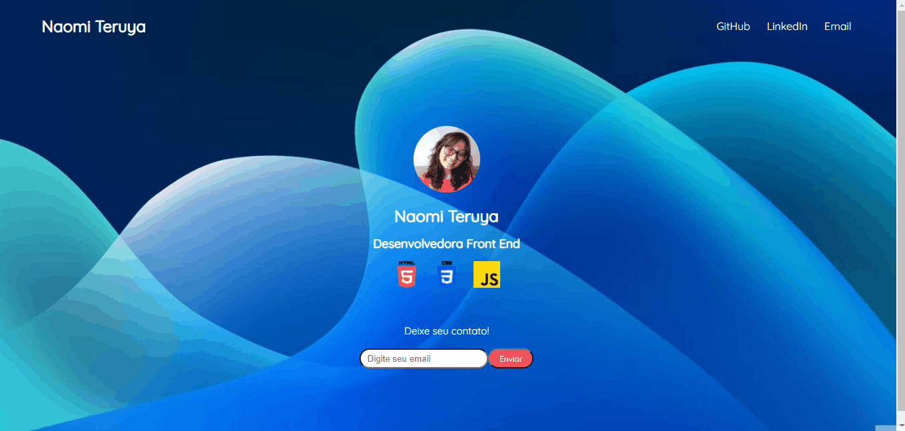

# Portfólio

Projeto proposto no curso de CSS do Módulo de Aquecimento do Bootcamp Hiring Coders #3 proporcionado pela Gama Academy em parceria com a VTEX. Desenvolvi um protfólio simples, mas a ideia é eu ir implementando aos poucos, conforme a minha evolução no aprendizado :)

